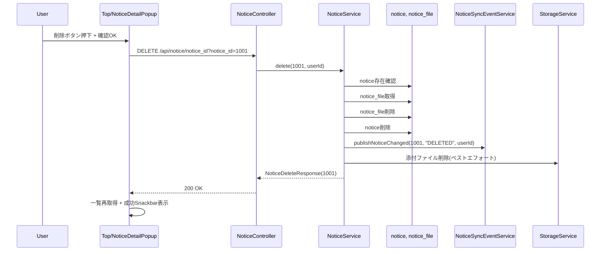
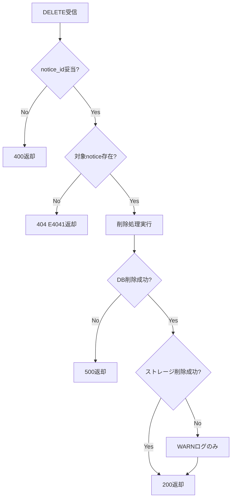

# お知らせ削除機能_詳細設計

## 1. ドキュメント目的
`要件定義.md` を実装可能な粒度へ落とし込み、バックエンド/フロントエンド/テストの具体的な変更点と処理フローを定義する。

## 2. 設計方針
- 既存のお知らせ機能（`list/detail/create/update/upload/download`）に対する拡張とする。
- 既存共通基盤（`@RequirePermission`、`apiClient`、`handleApiError`、`useSnackbar`）を必ず利用する。
- 削除方式は物理削除を採用する。
- ストレージ実ファイル削除はベストエフォートとし、失敗時はWARNログのみで主処理結果を維持する。

## 3. I/F詳細設計

## 3-1. API仕様
| 項目 | 内容 |
|---|---|
| Method | `DELETE` |
| Path | `/api/notice/notice_id` |
| Query | `notice_id`（必須, Long, `> 0`） |
| 認可 | `@RequirePermission(permissionId = 4, statusLevelId = 3)` |
| 概要 | 指定したお知らせを削除する |

### 成功レスポンス
```json
{
  "noticeId": 1001
}
```

### エラーレスポンス
- `400`: パラメータ不正（型不正、`notice_id <= 0`）
- `401`: 未認証
- `403`: 権限なし
- `404`: 対象なし（`E4041`）
- `500`: 想定外エラー

## 3-2. FE APIラッパ
- 追加関数: `deleteNoticeApi(noticeId: number): Promise<void>`
- 追加先: `src/api/services/v1/real/noticeService.ts`
- 利用先: `src/pages/Top/index.tsx` の `handleNoticeDelete`

## 4. バックエンド詳細設計

## 4-1. 変更対象
- `BE/appserver/src/main/java/com/example/appserver/controller/NoticeController.java`
- `BE/appserver/src/main/java/com/example/appserver/service/NoticeService.java`
- `BE/servercommon/src/main/java/com/example/servercommon/repository/NoticeFileRepository.java`
- （新規）`BE/appserver/src/main/java/com/example/appserver/response/notice/NoticeDeleteResponse.java`
- （新規）DB Migration: `endpoint_authority_mapping` のDELETE追加

## 4-2. Controller設計
### 追加メソッド
- `delete(@RequestParam("notice_id") Long noticeId, Locale locale)`

### 処理
1. `notice_id` の妥当性チェック（`<= 0` は `400`）
2. 現在ユーザーID取得（未認証時 `401`）
3. `noticeService.delete(noticeId, userId)` 実行
4. 結果なしは `404 (E4041)` を返却
5. 成功時 `200 + NoticeDeleteResponse` を返却

## 4-3. Service設計
### 追加メソッド
- `Optional<NoticeDeleteResponse> delete(Long noticeId, String userId)`

### 擬似コード
```java
@Transactional
Optional<NoticeDeleteResponse> delete(Long noticeId, String userId) {
  Notice notice = noticeRepository.findById(noticeId).orElse(null);
  if (notice == null) return Optional.empty();

  List<NoticeFile> files = noticeFileRepository.findAllByNoticeId(noticeId);
  List<String> docIds = files.stream().map(NoticeFile::getDestinationUrl).toList();

  noticeFileRepository.deleteAllByNoticeId(noticeId);
  noticeRepository.delete(notice);

  noticeSyncEventService.publishNoticeChanged(noticeId, "DELETED", userId);
  deleteStorageFilesQuietly(docIds); // 失敗してもロールバックしない

  return Optional.of(new NoticeDeleteResponse(noticeId));
}
```

### 補助処理
- `deleteStorageFilesQuietly(List<String> docIds)` を `NoticeService` 内部に追加
- `StorageService` の削除系APIを利用（環境実装差異は吸収）
- 例外は握りつぶさず `warn` ログを出力

## 4-4. Repository設計
`NoticeFileRepository` に以下を追加:
- `List<NoticeFile> findAllByNoticeId(Long noticeId);`
- `void deleteAllByNoticeId(Long noticeId);`

## 4-5. 権限マッピング設計
`endpoint_authority_mapping` に以下を追加する migration を作成:
- `('/api/notice/notice_id', 'DELETE', 9002, 2, CURRENT_TIMESTAMP, CURRENT_TIMESTAMP)`

## 5. フロントエンド詳細設計

## 5-1. 変更対象
- `FE/spa-next/my-next-app/src/api/apiEndpoints.ts`
- `FE/spa-next/my-next-app/src/api/services/v1/real/noticeService.ts`
- `FE/spa-next/my-next-app/src/pages/Top/index.tsx`
- `FE/spa-next/my-next-app/src/pages/notice/NoticeDetailPopup.tsx`

## 5-2. APIエンドポイント
`API_ENDPOINTS.NOTICE` に削除定義を追加:
- `DELETE: '/api/notice/notice_id'`

## 5-3. noticeService設計
追加:
```ts
export const deleteNoticeApi = async (noticeId: number): Promise<void> => {
  await apiClient.delete(API_ENDPOINTS.NOTICE.DELETE, { params: { notice_id: noticeId } });
};
```

例外時は既存同様に `handleApiError` を経由する。

## 5-4. Top画面設計
- `handleNoticeDelete` を実装する。
- 処理手順:
1. 確認ダイアログでユーザー確認
2. `deleteNoticeApi(noticeId)` 呼び出し
3. 成功時: popup閉じる、`fetchNotices()`、成功Snackbar
4. 失敗時: エラーSnackbar

## 5-5. NoticeDetailPopup設計
- detailモードかつ `canEditNotice=true` で削除ボタン表示
- createモードでは非表示
- `onDelete(notice.id)` を呼ぶ
- editモード中は誤操作防止のため削除ボタンを非表示にする

## 6. 処理フロー

## 6-1. 正常系フロー


## 6-2. 異常系フロー


## 7. エラー設計
- `notice_id` 型不正: Spring標準 `400`
- `notice_id <= 0`: 明示的に `400`
- 対象なし: `E4041`
- ストレージ削除失敗: API成功を維持し、サーバログへWARN出力
- Syncイベント登録失敗: 主処理失敗として `500`（再実行可能）

## 8. テスト詳細設計

## 8-1. BE（Controller）
- `DELETE` 正常: `200` + `noticeId`
- 対象なし: `404` + `E4041`
- `notice_id` 不正値: `400`
- `notice_id` 負値: `400`

## 8-2. BE（Service）
- `notice` と `notice_file` が削除されること
- `publishNoticeChanged(..., "DELETED", ...)` が呼ばれること
- ストレージ削除失敗時でも成功レスポンスを返せること

## 8-3. FE（IT）
- 権限あり時に削除ボタンが表示される
- 権限なし時に削除ボタンが非表示
- 削除成功で対象行が一覧から消える
- 削除404/500でエラーSnackbarが表示される

## 9. 実装順序
1. BE: Response/Repository/Service/Controller 実装
2. BE: 権限マッピング migration 追加
3. FE: endpoint + service + Top + popup 実装
4. テスト追加（BE UT -> FE IT）
5. 結合確認（一覧表示から削除操作）

## 10. 更新履歴
| ver | 更新日 | 更新者 | 内容 |
|-----|--------|--------|------|
| 0.1 | 2026/04/08 | 大路 | 初版作成（お知らせ削除機能の詳細設計） |

