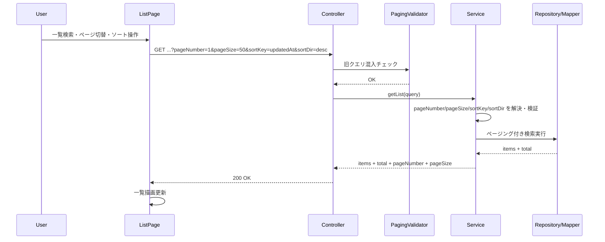
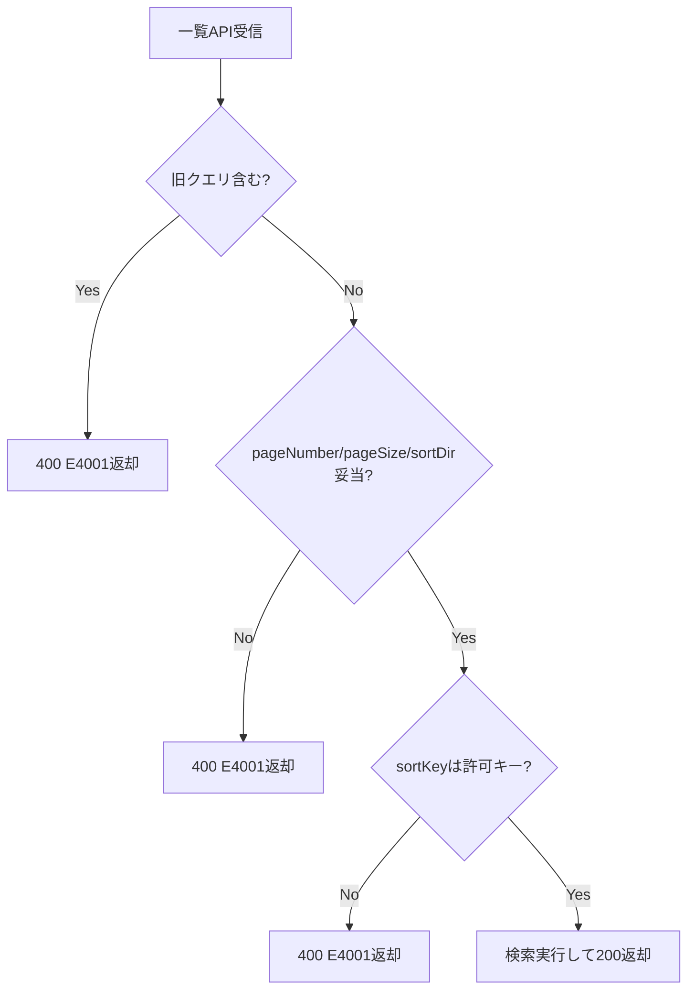

# 一覧APIページング標準化_詳細設計

## 1. ドキュメント目的
`要件定義.md` の内容を、実装・テスト可能な粒度に具体化する。  
対象4API（`user/roles/manual/batch-list`）のページング・ソート仕様を統一し、旧クエリを受け付けない一括置換の詳細を定義する。

## 2. 設計方針
- 移行フェーズは設けず、BE/FEを同一リリースで統一仕様へ置換する。
- 対象APIのクエリは `pageNumber/pageSize/sortKey/sortDir` に統一する。
- 旧クエリ（`page/size/sortBy/pagesize/pageNo/sortOrder`）は `400(E4001)` で明示的に拒否する。
- 既存の業務検索条件（`name`, `roleId`, `titleName`, `base`, `batch` など）は維持する。
- レスポンスは既存の一覧キー（`users/roles/manuals/value`）を維持しつつ、`pageNumber/pageSize/total` を明示する。

## 3. I/F詳細設計

## 3-1. 共通クエリ仕様
| 項目 | 型 | 必須 | 制約 | 備考 |
|---|---|---|---|---|
| `pageNumber` | number | 任意 | `>= 1` | 未指定時 `1` |
| `pageSize` | number | 任意 | `1..100` | 未指定時 `50` |
| `sortKey` | string | 任意 | APIごとの許可キーのみ | 未指定時はAPI既定順 |
| `sortDir` | string | 任意 | `asc` / `desc` | 未指定時 `asc` |

### 旧クエリの拒否
- 拒否対象: `page`, `size`, `sortBy`, `pagesize`, `pageNo`, `sortOrder`
- 1つでも含まれていた場合、業務処理前に `400(E4001)` を返却する。

## 3-2. API別仕様（検索条件・ソート）
| API | 既存検索条件（維持） | `sortKey` 許可キー | 既定ソート |
|---|---|---|---|
| `/api/user/list` | `name`, `roleId`, `isLocked`, `isDeleted` | `userId`, `email`, `surname`, `givenName`, `roleId`, `isLockedOut`, `updatedAt` | `updatedAt desc` |
| `/api/roles/list` | `name`, `isDeleted` | `roleId`, `roleName`, `description`, `updatedAt` | `updatedAt desc` |
| `/api/manual/list` | `titleName`, `target`, `isdeleted` | `manualId`, `manualTitle`, `updatedDateTime` | `updatedDateTime desc` |
| `/system-transfer/batch-list` | `base`, `batch`, `startDate`, `baseExtMatFlag`, `batchExtMatFlag` | `startDate`, `endDate`, `baseCd`, `baseName`, `batchName` | `baseCd asc + startDate desc` |

注記:
- `manualId` は `Manual.id`、`manualTitle` は `Manual.title` にマップする。
- batch の `sortKey` は SQLカラムに変換して ORDER BY を構成する。

## 3-3. レスポンス仕様
### 共通
- `total` は全件数
- `pageNumber` はレスポンス対象ページ（1始まり）
- `pageSize` はレスポンス対象件数設定

### APIごとの data 形
- `/api/user/list`: `{ users, total, pageNumber, pageSize }`
- `/api/roles/list`: `{ roles, total, pageNumber, pageSize }`
- `/api/manual/list`: `{ manuals, total, pageNumber, pageSize }`
- `/system-transfer/batch-list`: `{ value, total, pageNumber, pageSize }`

## 3-4. エラー仕様
- `pageNumber < 1` / `pageSize < 1` / `pageSize > 100` / 不正 `sortDir`: `400(E4001)`
- 未許可 `sortKey`: `400(E4001)`
- 旧クエリ指定: `400(E4001)`
- エラー形式は既存 `ApiResponse.error(code, message)` を維持する。

## 4. バックエンド詳細設計

## 4-1. 変更対象
- `BE/appserver/src/main/java/com/example/appserver/controller/UserController.java`
- `BE/appserver/src/main/java/com/example/appserver/controller/RolePermissionController.java`
- `BE/appserver/src/main/java/com/example/appserver/controller/ManualController.java`
- `BE/appserver/src/main/java/com/example/appserver/controller/BatchListController.java`
- `BE/appserver/src/main/java/com/example/appserver/request/user/UserListQuery.java`
- `BE/appserver/src/main/java/com/example/appserver/request/role/RoleListQuery.java`
- `BE/appserver/src/main/java/com/example/appserver/request/manual/ManualListQuery.java`
- `BE/appserver/src/main/java/com/example/appserver/request/batchresult/BaseListRequest.java`
- `BE/appserver/src/main/java/com/example/appserver/service/UserService.java`
- `BE/appserver/src/main/java/com/example/appserver/service/RolePermissionService.java`
- `BE/appserver/src/main/java/com/example/appserver/service/ManualService.java`
- `BE/appserver/src/main/java/com/example/appserver/service/BatchListService.java`
- `BE/appserver/src/main/java/com/example/appserver/response/user/UserListData.java`
- `BE/appserver/src/main/java/com/example/appserver/response/role/RoleListData.java`
- `BE/appserver/src/main/java/com/example/appserver/response/manual/ManualListData.java`
- `BE/servercommon/src/main/java/com/example/servercommon/responseModel/base/CommonListResponse.java`
- `BE/servercommon/src/main/resources/mapper/BatchListMapper.xml`
- （新規）共通ページングDTO/変換/旧クエリ拒否ユーティリティ

## 4-2. 共通ページングDTO
新規 `CommonPagingQuery`（仮称）を appserver に追加し、各ListQueryが継承する。

```java
public class CommonPagingQuery {
  @Min(1) private Integer pageNumber;
  @Min(1) @Max(100) private Integer pageSize;
  private String sortKey;
  @Pattern(regexp = "^(?i)(asc|desc)$") private String sortDir;
}
```

### デフォルト解決
- `resolvedPageNumber = (pageNumber != null) ? pageNumber : 1`
- `resolvedPageSize = (pageSize != null) ? pageSize : 50`
- `resolvedSortDir = (sortDir != null) ? sortDir.lowercase : "asc"`

## 4-3. 旧クエリ拒否
Controllerで `@RequestParam MultiValueMap<String, String> rawParams` を受け取り、共通ユーティリティでチェックする。

```java
validateNoLegacyPagingParams(rawParams);
```

- 検出時: `CustomException(CODE_E4001, "<legacyParamName>")`
- 4対象APIで共通適用する。

## 4-4. Controller設計
- `@ModelAttribute` DTOを `pageNumber/pageSize/sortKey/sortDir` に置換。
- `BindingResult` エラー時は現行と同じ `E4001` を返却。
- `BatchListController` にも `@Valid + BindingResult` を追加し、他APIと同等の入力検証を行う。

## 4-5. Service設計
### User/Role/Manual（JPA）
- `PageRequest.of(pageNumber - 1, pageSize, sort)` を共通化（`PageRequestFactory` など）。
- `sortKey` はAPI別ホワイトリストでDBプロパティへ変換。
- 未許可 `sortKey` は `CustomException(E4001)`。
- `sortKey` 未指定時は既存既定ソートを維持。

### Batch（MyBatis + PageHelper）
- `BaseListRequest(pageNumber/pageSize/sortKey/sortDir)` を `BaseListParam(pageNo/pageSize/sortKey/sortOrder)` へ変換して既存Mapperを利用する。
- `pageNo = pageNumber`（1始まり）で統一し、0始まりは受け付けない。
- `sortKey` のホワイトリストを通過した値のみMapperへ渡す。
- `sortDir` は `asc/desc` のみ許可し、それ以外は `E4001`。

## 4-6. Batch SQL設計
`BatchListMapper.xml` の ORDER BY は現行の `sortKey` 分岐を維持しつつ、`sortOrder` を `asc/desc` 限定値のみ入力される前提にする。  
既定ソートは現行どおり `base_cd ASC, start_time DESC` とする。

## 4-7. レスポンスDTO設計
- `UserListData`, `RoleListData`, `ManualListData` に `pageNumber`, `pageSize` を追加。
- `CommonListResponse<T>` に `pageNumber`, `pageSize` を追加。
- 既存キー（`users/roles/manuals/value/total`）は変更しない。

## 5. フロントエンド詳細設計

## 5-1. 変更対象
- `FE/spa-next/my-next-app/src/types/userType.ts`
- `FE/spa-next/my-next-app/src/types/role.ts`
- `FE/spa-next/my-next-app/src/types/manual.ts`
- `FE/spa-next/my-next-app/src/api/services/v1/real/userService.ts`
- `FE/spa-next/my-next-app/src/api/services/v1/real/roleService.ts`
- `FE/spa-next/my-next-app/src/api/services/v1/real/manualService.ts`
- `FE/spa-next/my-next-app/src/api/services/v1/crj/common/batchResultService.ts`
- `FE/spa-next/my-next-app/src/components/functional/UserListPage.tsx`
- `FE/spa-next/my-next-app/src/pages/role/list/index.tsx`
- `FE/spa-next/my-next-app/src/pages/manual/list/index.tsx`
- `FE/spa-next/my-next-app/src/components/CRJ/batchResults/BatchResults.tsx`
- （必要に応じて）mock service / mock handler

## 5-2. 型定義
- 旧 `page/size/sortBy/pagesize/pageNo/sortOrder` を削除。
- 共通 `PagingQuery` 型（仮称）を追加:
```ts
type PagingQuery = {
  pageNumber: number;
  pageSize: number;
  sortKey?: string;
  sortDir?: "asc" | "desc";
};
```
- 各一覧Queryは `PagingQuery + 既存検索条件` で再定義。

## 5-3. APIサービス層
- `params` は必ず `pageNumber/pageSize/sortKey/sortDir` を送信する。
- 文字列連結でURLを組み立てている `batchResultService.ts` は、`apiClient.get(url, { params })` 形式へ変更する。
- batch レスポンス型は `ApiResponse<{ value: BatchStatus[]; total: number; pageNumber: number; pageSize: number }>` に更新する。

## 5-4. 画面側
- `UserListPage` / `RoleListPage` / `ManualListPage` の呼び出しクエリを新仕様へ置換。
- `ControllableListView` の `page` を `pageNumber` として送る（1始まりのまま）。
- `BatchResults` の `tableState.page` を 1始まりへ統一し、`+1/-1` 変換を削除する。
- batch のソート列IDとAPI `sortKey` の差異はマッピング関数で吸収する。  
  例: `executeBeginDate -> startDate`, `executeEndDate -> endDate`

## 6. 処理フロー

## 6-1. 正常系フロー


## 6-2. 異常系フロー（入力不正）


## 7. テスト詳細設計

## 7-1. BEテスト
- 4APIで `pageNumber/pageSize/sortKey/sortDir` 正常系が成功すること。
- `pageNumber=0`, `pageSize=0`, `pageSize=101`, `sortDir=up` が `400` になること。
- API別で未許可 `sortKey` が `400` になること。
- 旧クエリ指定時に `400` になること。
- レスポンスに `pageNumber/pageSize/total` が含まれること。

## 7-2. FEテスト
- 各一覧画面が新クエリのみを送信すること。
- `BatchResults` で 0/1始まり変換が消え、ページ遷移が崩れないこと。
- sort操作時に `sortKey/sortDir` が期待どおり送信されること。
- API 400時のエラー表示（Snackbar/ログ）が既存どおりであること。

## 8. 実装順序
1. BE共通Paging DTO/Validator/ユーティリティ追加  
2. 4APIのRequest/Controller/Serviceを新クエリへ置換  
3. レスポンスDTOへ `pageNumber/pageSize` 追加  
4. FE型定義・サービス層を新クエリへ置換  
5. 画面側（特に `BatchResults`）のページ処理を統一  
6. BE/FEテスト追加・回帰確認

## 9. 補足（今回の置換で明確化する点）
- 旧クエリは互換維持しない（完全置換）。
- pageNumberは全APIで1始まり固定。
- pageSize上限は `100` 固定で統一。
- 一覧キー名（`users/roles/manuals/value`）は互換維持のため変更しない。

## 10. 更新履歴
| ver | 更新日 | 更新者 | 内容 |
|-----|--------|--------|------|
| 0.1 | 2026/04/13 | 大路 | 初版作成（一覧APIページング標準化の詳細設計） |
| 0.2 | 2026/04/13 | 大路 | 共通キーを `pageNumber/pageSize/sortKey/sortDir` に変更 |
